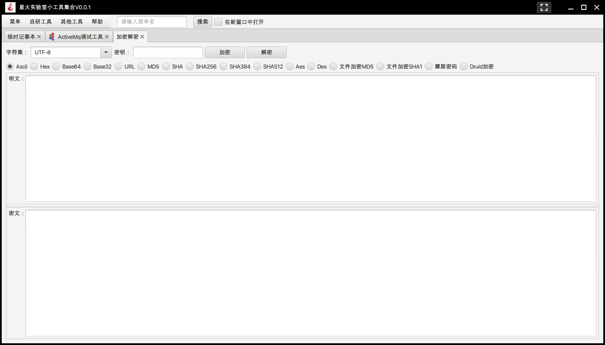

# 星火实验室GUI工具框架
项目来源于 
[xJavaFxTool-spring](https://gitee.com/xwintop/xJavaFxTool-spring) 进行修改

借助这个GUI框架，可以快速开发GUI漏洞利用工具等，同时方便工具的集成。

# Features

# 插件开发

插件开发示例见开源项目 [xJavaFxTool-plugin](https://gitee.com/xwintop/xJavaFxTool-plugin)

后续会逐步更新公开星火内部插件

# Licenses

本工具仅面向合法授权的企业安全建设行为，在使用本工具进行检测时，您应确保该行为符合当地的法律法规，并且已经取得了足够的授权。

如您在使用本工具的过程中存在任何非法行为，您需自行承担相应后果，作者将不承担任何法律及连带责任。

在使用本工具前，请您务必审慎阅读、充分理解各条款内容，限制、免责条款或者其他涉及您重大权益的条款可能会以加粗、加下划线等形式提示您重点注意。 除非您已充分阅读、完全理解并接受本协议所有条款，否则，请您不要使用本工具。您的使用行为或者您以其他任何明示或者默示方式表示接受本协议的，即视为您已阅读并同意本协议的约束。

# 安恒-星火实验室

<h1 align="center">
  
   
</h1>
专注于实战攻防与研究，研究涉及实战攻防、威胁情报、攻击模拟与威胁分析等，团队成员均来自行业具备多年实战攻防经验的红队、蓝队和紫队专家。本着以攻促防的核心理念，通过落地 ATT&CK 攻防全景知识库，全面构建实战化、常态化、体系化的企业安全建设与运营。